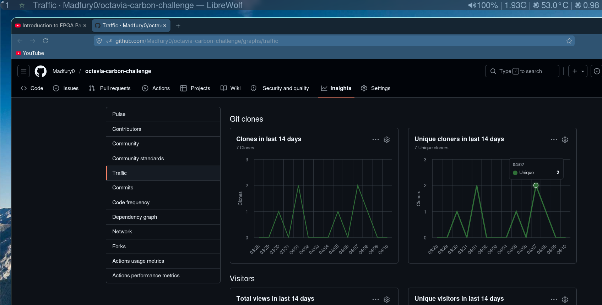
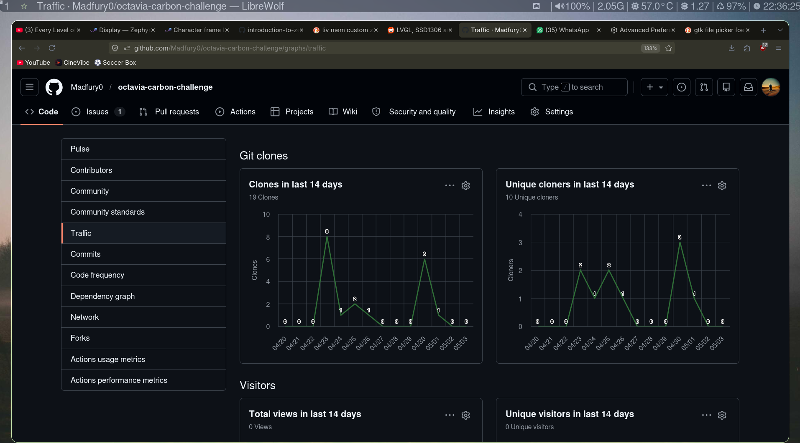

# TO WHOM IT MAY CONCERN,

## I KNOW YOU ARE READING THIS BECAUSE I HAVE BEEN WATCHING YOUR EVERY MOVE

update: moving from industrial compute to custom cyberdeck.

I am just a guy trying to do the right thing.

How do I explain to my Dad that an assignment I spent a painfull 4 days, with limited time has been cloned, get this

By 11th April, 2026:

Clones in the last 14 days: 7 clones, 7 unique cloners

Then, 4th May, 2026:

Clones in the last 14 days: 19 clones, 10 unique cloners

Then, 21st May, 2026:

Clones in the last 14 days: 25 clones, 15 unique cloners

So a total of about >50 clones since the day I submitted the assignment.

It was a fun project though, I did not rpi CM4 was a thing. I must get one.

The unique cloners, hello old friend. I hope you like the project.

Did you manage to fix all the DRC errors, if yes, can you create a pull request. I promise I will not pull a Torvald's on you.

But please, can I get the rejection letter, the suspense is killing me.

WE MEET ON THE NEXT ASSIGNMENT. HOPEFULLY SOMETHING CHALLENGING LIKE THE LAST TWO.

Images will be attached.

11th April screenshot:

4th May screenshot:

Madfury out.

